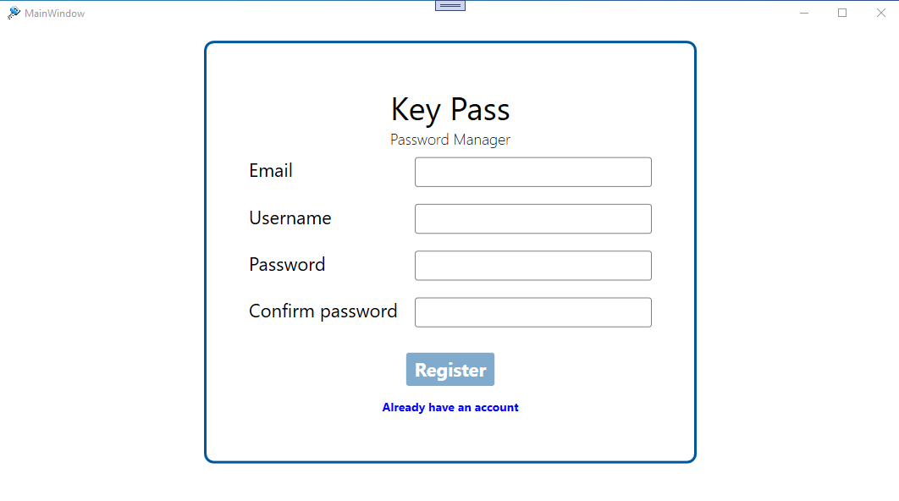
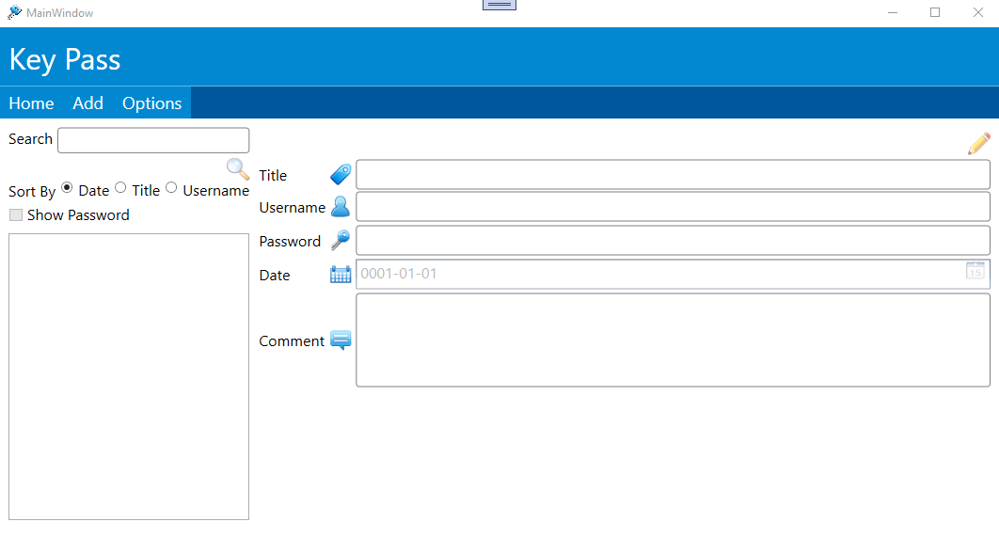
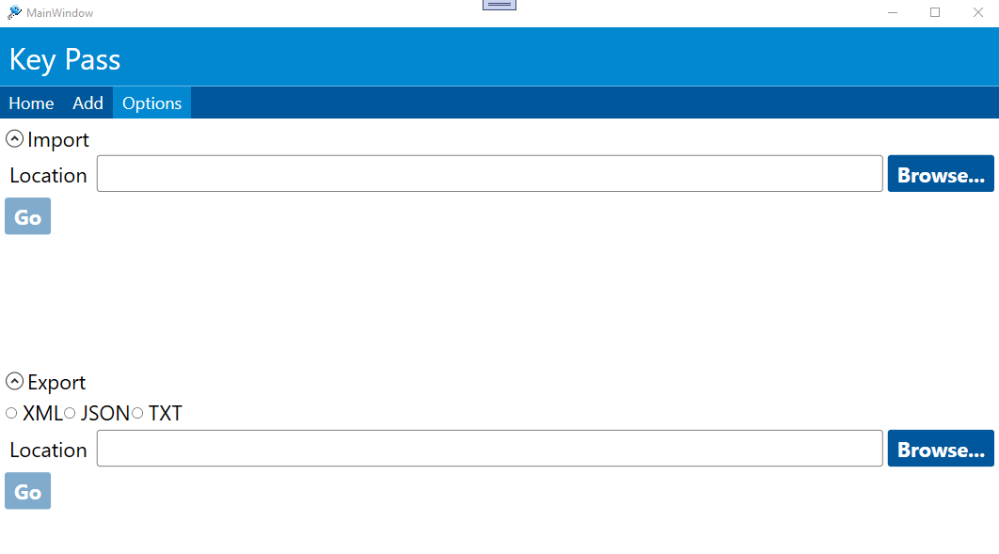

# WPF-Keypass
Password Manager

This project require MvvmFramework library.

App for stroring passwords.

<h3>Features and Technologies</h3>

<ul>  
  <li>Import/Export File</li>
  <li>Backup to file</li>  
  <li>Friendly design</li>  
  <li>Entityframework</li>
  <li>SQLite</li>
  <li>Cryptography Synchronous</li>
  <li>UnitOfWork Design Pattern</li>
  <li>Linq json, XML</li>
</ul>

# Login

  
  

    The login screen will show up as soon as the user launches the app. If they don't have an account, they will be
    able to create one by clicking the register link.
  

# New Account

  The user will be able to register a new account by adding the email, username and password. 

# Home Screen

    The home screen shows all the passwords that has been added before. They will be able to edit, modify and remove. 

# New Item

 

    The new item screen will show up as long as the user clicks the add button on the home screen.
 

# Backuping

    The user will be able to import or export a file in order to restore the content.
 
 

