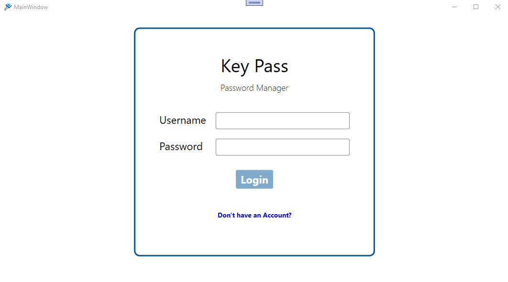

# WPF-Keypass
Password Manager

App for stroring passwords in the database safely.

<h3>Features</h3>

<ul>  
  <li>Import/Export File</li>
  <li>Backup to file</li>  
  <li>Friendly design</li>  
</ul>

<h3>Technologies</h3>

<ul>
  <li>Entityframework</li>
  <li>SQLite</li>
  <li>Cryptography Synchronous</li>
  <li>UnitOfWork Design Pattern</li>
  <li>Linq json, XML</li>
</ul>  

# Login

  
  

    The login screen will show up as soon as the user launches the app. If they don't have an account, they will be
    able to create one by clicking the register button.
  

# New Account

  The user will be able to register a new account by adding the username and password.

# Home Screen

    The home screen shows all the passwords that has been added before. They will be able to edit, modify and remove. The user will be able to import a file in order to restore the content from it.

# New Item

 

    The new item screen will show up as long as the user clicks the new item button on the home screen.
 

# Preference

  The preference screen is a place where the user will be able to not only change the language but also the username,       password and location of the backup file.

# Backuping

    The backup would be done as soon as the user closes the app if they set to do so on the preferecen screen.
 
 

